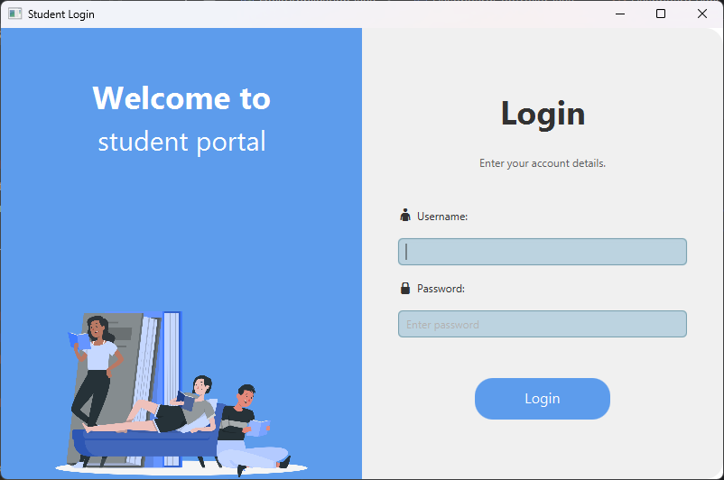
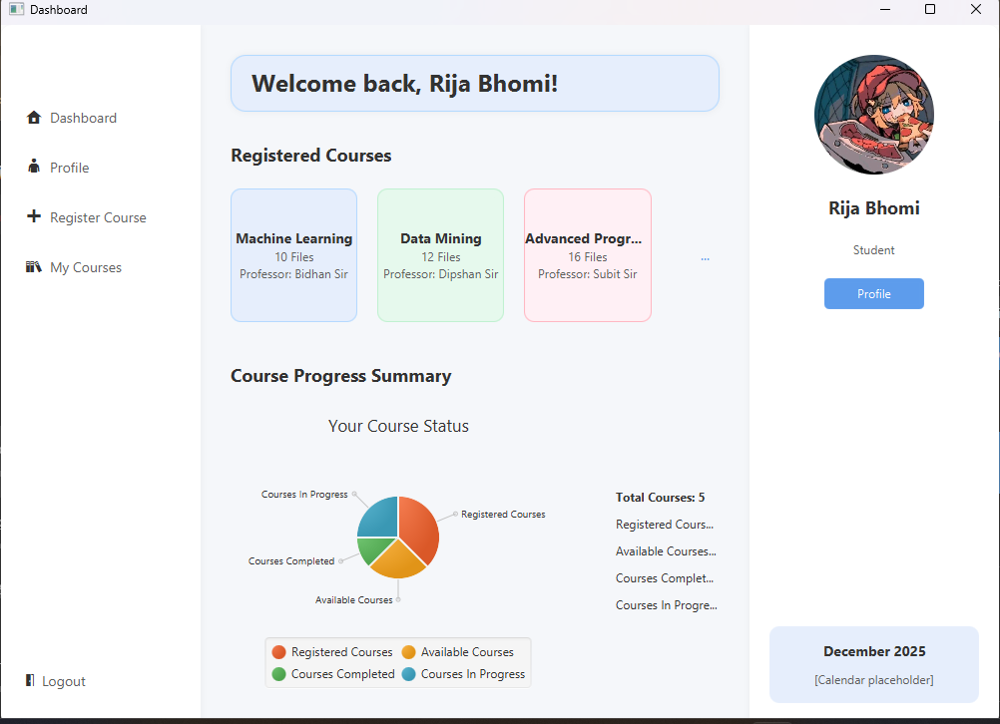
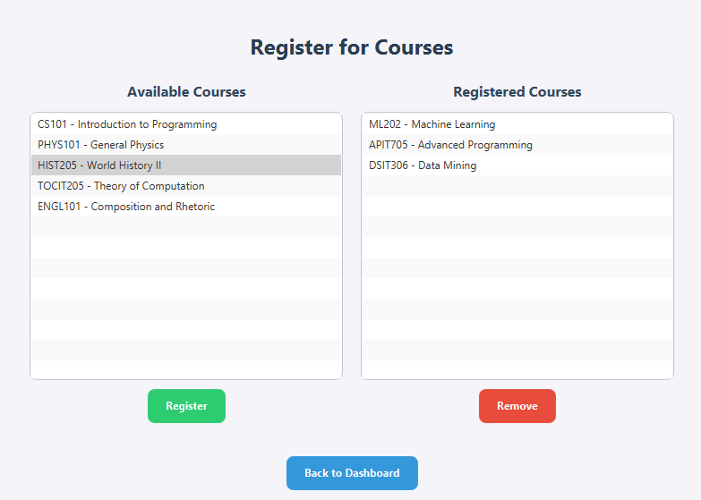
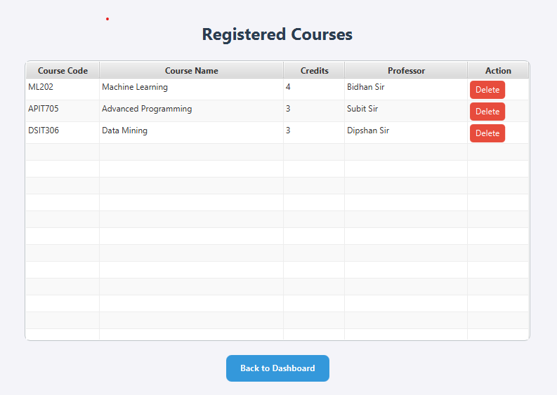

# Student Course Registration System

This is a desktop application built with JavaFX that provides a simple and intuitive interface for students to manage their course registrations. The system allows students to view their profile, register for new courses, remove existing ones, and see an overview of their academic progress.

## Features

-   **Student Dashboard**: A central hub with a welcome message and a summary of the student's course status using a pie chart.
-   **Profile Management**: A dedicated page to view and potentially edit student profile information.
-   **Course Registration**: An interface to register and unregister from available courses.
-   **Course Persistence**: Course registration data is saved to a file, so it persists between application runs.
-   **Navigation**: A responsive sidebar for easy navigation between different sections of the application.

  
_A screenshot of the login page._

  
_A screenshot of the main dashboard._

  
_A screenshot of the register courses._

  
_A screenshot of the registered courses._

## Technologies Used

-   **JavaFX**: For building the graphical user interface.
-   **Java**: The core programming language.
-   **FXML**: For declarative UI layout.
-   **CSS**: For styling the application's appearance.

Here is the content for the `README.md` file. You can copy and paste this directly.

```markdown

├── src
│   ├── main
│   │   ├── java
│   │   │   └── com.example.student\_courseregistration\_system
│   │   │       ├── controllers  \# Contains all the FXML controllers (e.g., DashboardController)
│   │   │       ├── models       \# Contains data model classes (e.g., Student, Course)
│   │   │       └── utils        \# Contains utility classes for file I/O (e.g., DataManager)
│   │   └── resources
│   │       └── com.example.student\_courseregistration\_system
│   │           ├── \*.fxml       \# All FXML layout files
│   │           ├── styles.css   \# Main CSS file for styling
│   │           └── profilePic.jpeg  \# Example image asset
├── pom.xml                      \# Maven project configuration
├── all\_courses.txt              \# File containing all available courses
└── registered\_courses.txt       \# File containing a list of registered courses for persistence
```
## Getting Started

### Prerequisites

-   Java Development Kit (JDK) 11 or higher
-   Maven or Gradle (if not using an IDE's built-in tools)
-   An IDE like IntelliJ IDEA or Eclipse with JavaFX support

### Setup and Running the Application

1.  **Clone the repository:**
    ```bash
    git clone [https://github.com/your-username/Student-CourseRegistration-System.git](https://github.com/your-username/Student-CourseRegistration-System.git)
    cd Student-CourseRegistration-System
    ```
2.  **Open in your IDE:**
    * Open the project as a Maven or Gradle project in your IDE.
    * The IDE should automatically download the necessary dependencies.
3.  **Run the application:**
    * Find the main class (e.g., `HelloApplication.java`) and run it. This will launch the application window.

## Usage

-   **Login:** The application opens to a login page (if implemented).
-   **Dashboard:** After logging in, you will be taken to the dashboard, where you can see a summary of your courses.
-   **Navigation:** Use the sidebar on the left to switch between different sections like Profile, Register Course, and My Courses.
-   **Registering Courses:** On the "Register Course" page, select a course from the "Available Courses" list and click the **Register** button to add it to your registered courses.
-   **Removing Courses:** Select a course from the "Registered Courses" list and click the **Remove** button.

